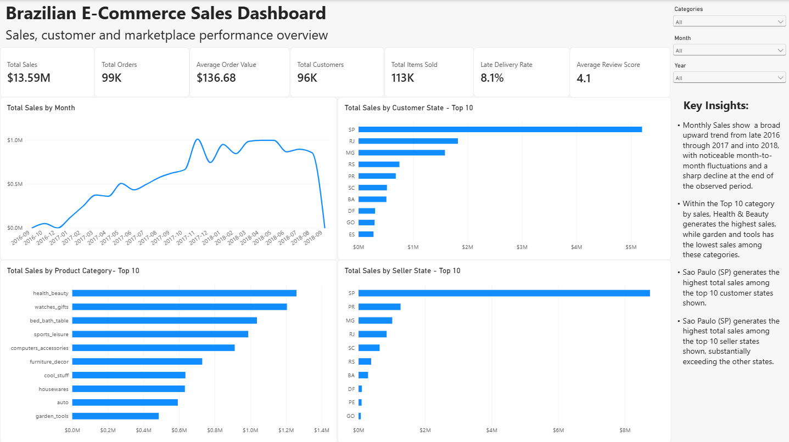
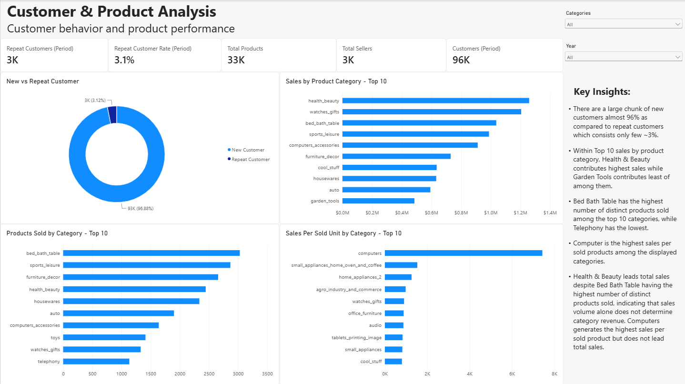
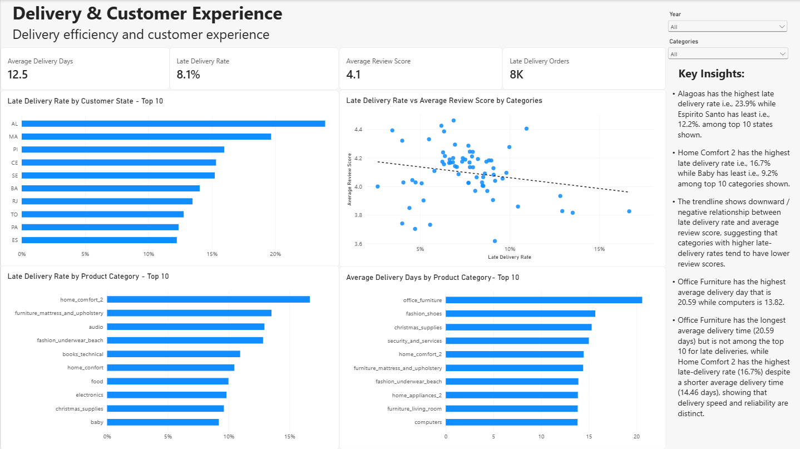

# Brazilian E-Commerce Sales & Operations Analytics

Power BI analysis of Brazilian e-commerce sales, customer behavior, product performance, delivery operations, and customer experience.

## Project Overview

This project analyzes the Brazilian Olist e-commerce marketplace using transactional, customer, product, seller, payment, review, and delivery data.

The objective was to transform raw e-commerce data into an interactive Power BI dashboard that provides insights into sales performance, customer behavior, product performance, delivery operations, and customer experience.

The analysis covers approximately 100,000 orders from 2016–2018.

## Business Problem

An e-commerce marketplace needs to understand not only how much it sells, but also which categories and markets drive sales, how customers behave, and whether operational performance is associated with customer experience.

The analysis focuses on:

- Sales performance over time
- Product category and geographic sales performance
- New vs. repeat customer behavior
- Product volume and sales productivity
- Late-delivery performance by state and category
- Relationship between delivery performance and review scores
- Delivery duration vs. delivery reliability

## Dataset

The project uses the **Olist Brazilian E-Commerce Public Dataset**.

Key tables include:

- Orders
- Order Items
- Customers
- Products
- Sellers
- Payments
- Reviews
- Category Translation

A dedicated Date table was also created for time-based analysis.

The dataset contains approximately 100,000 orders covering 2016–2018.

## Data Preparation

Data preparation was performed using Power Query.

Key steps included:

- Importing and reviewing the required tables
- Validating data types
- Checking missing values
- Validating primary and composite key uniqueness
- Identifying expected duplicates in transactional tables
- Renaming unclear fields
- Creating a dedicated Date table
- Building and validating relationships between tables
- Testing slicers and cross-filtering across the report

The geolocation table was excluded because it was not required for the final analysis.

## Data Model

The Power BI model connects the major transactional and reference tables through relationships between:

- Customers → Orders
- Orders → Order Items
- Products → Order Items
- Sellers → Order Items
- Orders → Payments
- Orders → Reviews
- Category Translation → Products
- Date → Orders

The model was tested to ensure that filters and slicers correctly affected the relevant measures and visuals.

## DAX & Key Metrics

DAX was used to create business-focused measures, including:

- Total Sales
- Total Orders
- Total Items Sold
- Average Order Value
- Total Customers
- Repeat Customers
- Repeat Customer Rate
- Average Review Score
- Average Delivery Days
- Late Delivery Orders
- Late Delivery Rate
- Products Sold
- Sales per Sold Product
- Sales Year-over-Year

The calculations included distinct customer counting, repeat-customer analysis, delivery-date comparisons, delivery-duration calculations, category-level sales productivity, and time-intelligence analysis.

## Dashboard

The final Power BI report contains three analytical pages.

### 1. Executive Sales Dashboard

Provides an overview of:

- Sales performance
- Orders
- Customers
- Items sold
- Delivery performance
- Customer reviews
- Sales by category and geography

### 2. Customer & Product Analysis

Focuses on:

- New vs. repeat customers
- Category sales
- Products sold by category
- Sales per sold product
- Customer and product KPIs

### 3. Delivery & Customer Experience

Focuses on:

- Late-delivery rates
- Average delivery time
- Delivery performance by state
- Delivery performance by category
- Relationship between late delivery and review scores

## Dashboard Screenshots

### Executive Sales Dashboard



### Customer & Product Analysis



### Delivery & Customer Experience



## Key Findings

### Sales Performance

Monthly sales show a broad upward trend from late 2016 through 2017 and into 2018, with noticeable month-to-month fluctuations and a sharp decline at the end of the observed period. The final period is incomplete, so this decline should be interpreted cautiously.

### Category Performance

Health & Beauty leads total sales despite Bed Bath Table having the highest number of distinct products sold. Computers generates the highest sales per sold product without leading total sales, indicating that product volume and sales productivity do not necessarily translate into the highest total category sales.

### Customer Behavior

The customer base is heavily weighted toward new customers, with approximately 96–97% new customers versus about 3–4% repeat customers within the selected period.

### Delivery & Reviews

The category-level trendline indicates a negative association between late-delivery rate and average review score, with categories having higher late-delivery rates generally showing lower review scores.

### Delivery Speed vs. Reliability

Office Furniture has the longest average delivery time (20.59 days) but is not among the top 10 for late deliveries, while Home Comfort 2 has the highest late-delivery rate (16.7%) despite a shorter average delivery time (14.46 days). This shows that delivery speed and delivery reliability are distinct measures.

## Business Implications

The analysis highlights several areas for further investigation:

- Overall sales growth is positive, but the sharp decline at the end of the dataset should be investigated while accounting for the incomplete final period.
- Differences between product volume, total sales, and sales per sold product suggest that category performance should be evaluated using multiple metrics.
- The low repeat-customer share indicates an opportunity to investigate factors associated with customer retention and repeat purchases.
- Higher late-delivery rates are associated with lower review scores at the category level, making delivery reliability an area worth investigating for customer-experience improvement.
- Average delivery time and late-delivery rate provide different views of operational performance and should be evaluated together.

## Tools & Skills

**Tools**

- Power BI
- Power Query
- DAX

**Skills demonstrated**

- Data cleaning and validation
- Data transformation
- Relational data modeling
- DAX measure development
- Time-series analysis
- Customer analysis
- Product/category analysis
- Operational performance analysis
- Data visualization
- Business insight generation

## Limitations

- The dataset covers 2016–2018 and may not represent current e-commerce conditions.
- The final observed period is incomplete.
- The analysis identifies associations but does not establish causality.
- The dataset does not contain variables such as profit margins, marketing expenditure, conversion rates, or detailed shipping-policy information.
- Business implications therefore represent areas for further investigation rather than definitive causal conclusions.

## Project Structure

```text
brazilian-ecommerce-sales-operations-analytics/
│
├── dashboard-screenshots/
│   ├── 01_executive_sales_dashboard.png
│   ├── 02_customer_product_analysis.png
│   ├── 03_delivery_customer_experience.png
│   └── README.md
│
├── data/
│   └── .gitkeep
│
└── README.md
```

## Conclusion

This project demonstrates an end-to-end analytical workflow from data preparation and relational modeling to DAX-based analysis, interactive visualization, and business insight generation.
